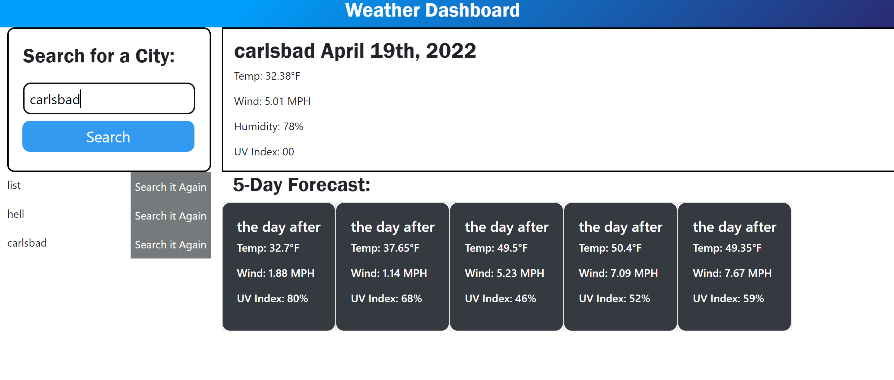

# Weather Dashboard :cloud_with_lightning_and_rain:

## Description
This weather dashboard will give the user access to the weather outloook for multiple cities. When the user seaches for a city, they are presented with current and future conditions for that city. The city is stored in local storage for future referene.  When viewing the current weather condidtions for that city, the user is given the city name, the date and an icon representation of weather conditions, the temperature, the humidity, wind speedm and the UV index. The UV index is presented by a color indicating favorable conditions, moderate or severe. For future weather conditions for that city, a 5-day forecast is desplayed with the date, icons to represent weather conditons. When the user clicks on a city in the search history, the current and future weather conditons are displayed for that city.

## Installation 
This application should work on most browsers. See the deployed 

# Screenshots

# Credits

## Author
- Anita Chavez
- :briefcase: [Portfolio](https://neeta525.github.io/Portfolio25/)
- :octocat: [GitHub](https://github.com/Neeta525)

## Built With:
- HTML
- CSS
- JavaScript

## License

- MIT

 for (var i = 0; i < citiesList.length; i++) {
        var list = citiesList[i];

        var li = document.createElement("li");
        li.textContent = list;
        li.setAttribute("data-index", i);

        var button = document.createElement("button");
        button.textContent = ("Search it Again");

        li.appendChild(button);
        // console.log(list)
        cityList.appendChild(li);
        button.addEventListener("click", function() {
            getCoords(list);
        
            historyContainerSpan.append(cityList);
        
            // storeCities();
            // renderCitiess();
            }
        );
    }